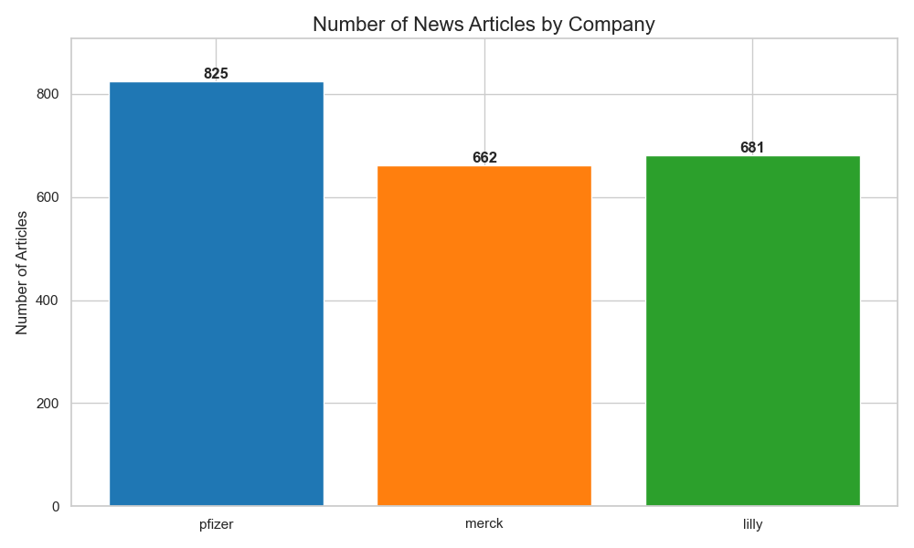

# Pharma News Scraper

A tool for scraping pharmaceutical news and press releases from major pharmaceutical companies' websites to gather insights about industry trends, regulatory approvals, clinical trials, and more.

## Data Insights

### Overview
This repository contains news data from three major pharmaceutical companies:
- Pfizer (825 articles)
- Merck (662 articles)
- Eli Lilly (681 articles)

Total articles collected: **2,168** spanning from January 2019 to December 2024.

### Key Findings

#### Top 5 News Categories:
1. Clinical Trial Updates (660 articles)
2. Regulatory Approvals (457 articles)
3. Financial News (379 articles)
4. Management Updates (312 articles)
5. Commercialized Drug Updates (126 articles)

#### Distribution of News Categories


#### Articles by Company


#### Top Categories by Company


#### News Publication Timeline


## Features

- Scrapes news articles from major pharmaceutical companies:
  - Pfizer
  - Merck
  - Eli Lilly
- Cleans and processes the scraped data
- Categorizes news articles by type (regulatory approval, clinical trial updates, etc.)
- Stores data in structured CSV format
- Generates statistics and visualizations of the collected data

## Project Structure

```
├── README.md
├── requirements.txt
├── .env.example
├── .gitignore
├── main.py                 # Command-line interface
├── src/
│   ├── scrapers/           # Company-specific web scrapers
│   ├── utils/              # Helper utilities
│   └── data_processing/    # Data cleaning and processing
└── data/
    ├── raw/                # Raw scraped data
    ├── processed/          # Processed data
    ├── clean/              # Final cleaned dataset
    └── stats/              # Statistics and visualizations
        └── plots/          # Generated charts and graphs
```

## Setup and Installation

1. Clone this repository
```bash
git clone https://github.com/samueltof/pharma-news-scraping.git
cd pharma-news-scraping
```

2. Create and activate a virtual environment
```bash
python -m venv venv
source venv/bin/activate  # On Windows: venv\Scripts\activate
```

3. Install dependencies
```bash
pip install -r requirements.txt
```

4. Set up environment variables
```bash
cp .env.example .env
# Edit .env file with your API keys
```

## Usage

### Running the scrapers

```bash
# Run all scrapers
python main.py scrape

# Run scraper for a specific company
python main.py scrape --company pfizer
python main.py scrape --company merck
python main.py scrape --company lilly

# Process and clean the data
python main.py process --input data/raw --output data/processed

# Generate statistics and visualizations
python src/data_processing/generate_stats.py
```

## API Keys Required

This project requires API keys for:
- AgentQL
- Spider API

## License

[MIT License](LICENSE) 